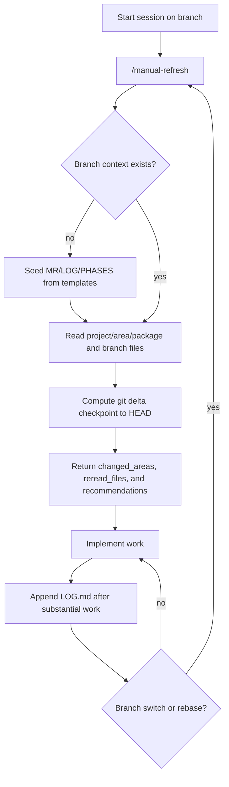

# OpenCode Handoff Kit (Reusable)

This repository is a reusable starter kit for descriptor-driven OpenCode handoff workflows.

## What this kit includes

- Generic docs:
  - `OPENCODE_HANDOFF_GENERIC.md`
  - `COMMAND_WORKFLOW.md`
  - `TEST_PLAN.md`
- Generic rule:
  - `rules/HANDOFF_GENERIC.md`
- Generic commands:
  - `commands/project-bootstrap.md`
  - `commands/project-refresh.md`
  - `commands/project-phases.md`
  - `commands/manual-refresh.md`
- Fallback skills:
  - `skills/project-manual-refresh-fallback.md`
- Generic descriptor template:
  - `descriptors/descriptor.template.json`
  - `descriptors/examples/example-project.descriptor.json`
- Branch templates:
  - `templates/mr/MERGE_REQUEST.md`
  - `templates/mr/LOG.md`
  - `templates/mr/PHASES.md`
- Tool entrypoints:
  - `tools/opencode_bootstrap_branch.ts`
  - `tools/opencode_refresh_context.ts`
  - `tools/_opencode_engine.ts`

## How to use in a new machine/project

1. Clone this repo anywhere (for example under `~/projects`).
2. Copy the needed files into `~/.config/opencode/`:
  - `rules/*` -> `~/.config/opencode/rules/`
  - `commands/*` -> `~/.config/opencode/commands/`
  - `tools/*` -> `~/.config/opencode/tools/`
3. Create a project descriptor:
  - `~/.config/opencode/projects/<projectKey>/descriptor.json`
  - start from `descriptors/descriptor.template.json`
4. Copy template files into:
  - `~/.config/opencode/projects/<projectKey>/_templates/mr/`
5. Update `~/.config/opencode/opencode.json`:
  - include the handoff rule in `instructions`
  - allow custom tools in `permission`
  - allow external directory access to `~/.config/opencode/projects/**`

## End-to-end workflow examples

### Example 1: New workspace + new branch

1. Open repo workspace.
2. Run `project-refresh` (or project-specific refresh command).
3. If missing branch context, run `project-bootstrap`.
4. Decide phased delivery (`yes`/`no`).
5. Start implementation; append session notes to branch `LOG.md`.

### Example 2: New agent in existing branch workspace

1. Agent runs refresh first.
2. Agent re-reads only returned `reread_files`.
3. Agent continues implementation with existing MR goals.
4. Agent appends decisions/checkpoints to `LOG.md`.

### Example 3: Branch becomes too large

1. Run `project-phases`.
2. Create phase plan (AI draft, user-led, or hybrid).
3. Continue with phase-by-phase execution and logging.

## Manual mode (commands/tools unavailable)

If command or tool-calling is unavailable, you can still run the full workflow manually.

1. Resolve `<projectKey>` and active branch.
2. Ensure branch folder exists:
  - `~/.config/opencode/projects/<projectKey>/branches/<branch-name>/`
3. Seed missing files from templates:
  - `MERGE_REQUEST.md`
  - `LOG.md`
  - optional `PHASES.md`
4. Read context layers in order:
  - project `AGENTS.md`
  - relevant area `AGENTS.md`
  - package `AGENTS.md` if needed
  - branch MR/PHASES/LOG
5. Ask the agent to run a manual refresh:
  - inspect commits/files since checkpoint (`reviewed_through`)
  - produce `changed_areas`, `reread_files`, and recommendations
6. Append branch `LOG.md` after substantial work.

This manual mode keeps handoff continuity even when command automation is temporarily down.

### Quick start sentence (exact)

Use this exact prompt to start manual mode quickly:

`Tool-calling is disabled. Run manual handoff refresh for project key <projectKey> using branch context files and git delta, then return branch, checkpoint->head, changed_areas, reread_files, and recommendations.`

Shortcut command equivalent:
- `/manual-refresh <projectKey>`

### Which one should I use?

Use this priority:

1. `/manual-refresh <projectKey>` (best day-to-day path)
2. exact quick-start sentence (if command parsing fails)
3. full long-form prompt (if you are in another environment without command files)

The long prompt remains relevant as the canonical fallback spec, but it should not be your primary daily entry point.

### Why this system exists (plain language)

- Agents forget branch intent when sessions restart; branch files preserve intent.
- Rules can be broad; branch files keep session-level details small and focused.
- Manual fallback avoids hard-blocking work when provider/tool-calling is unstable.
- Descriptor + templates make the workflow portable to other projects.

### Visual workflow (manual mode)



### Use-case playbook

- **New branch:** run `/manual-refresh <projectKey>`, let agent seed missing files, verify `branches/<branch>/`.
- **Existing branch, new session:** run `/manual-refresh <projectKey>`, confirm checkpoint and reread targets.
- **Large branch:** keep manual refresh flow, then create/update `PHASES.md` manually in the same branch folder.
- **Handoff to teammate/agent:** refresh, then add concise `LOG.md` entry with decisions, risks, and next task.
- **Post-rebase/squash:** refresh immediately, add history-rewrite note, continue.

### Manual mode workflow sequence (now)

1. Start new session on target branch.
2. Send the quick-start sentence above.
3. If branch files are missing, create/seed from templates.
4. Re-read project -> area -> package -> branch files in order.
5. Compute git delta from checkpoint to head.
6. Return structured refresh summary.
7. Implement changes.
8. Append `LOG.md` after substantial work.
9. Repeat from step 2 on branch switch/rebase/new session.

### Edge cases and what to do

- **Missing branch files**
  - Behavior: refresh cannot anchor to branch context.
  - Action: seed from templates, then rerun manual refresh.

- **Checkpoint SHA no longer exists (after rebase/squash)**
  - Behavior: stale `reviewed_through`.
  - Action: use fallback commit window, then write new checkpoint note to `LOG.md`.

- **Branch merged**
  - Behavior: branch folder becomes historical.
  - Action: ask user to choose `archive` vs `promote-and-delete`.

- **Agent drifts across branches**
  - Behavior: recommendations reference wrong branch files.
  - Action: rerun `/manual-refresh <projectKey>` and verify branch name in summary.

- **Provider/tool path unstable again**
  - Behavior: command/tool errors.
  - Action: stay on manual mode; do not block delivery on automation availability.

### Junior-friendly operating notes

- Treat `MERGE_REQUEST.md` as "what we are trying to achieve".
- Treat `LOG.md` as "what happened, why, and what is next".
- Keep `LOG.md` concise and factual; avoid long essays.
- Prefer small frequent updates over one huge update at end of day.
- If unsure whether to update shared `AGENTS.md`, log first and propose promotion after merge.

### Copy/paste manual refresh prompt

```md
Manual refresh mode (tool-calling unavailable).

Project key: <projectKey>
Please follow this process and return a concise report:

1) Resolve current git branch and repo root.
2) Read, in order:
   - ~/.config/opencode/projects/<projectKey>/AGENTS.md
   - relevant area AGENTS.md
   - relevant package AGENTS.md (if applicable)
   - ~/.config/opencode/projects/<projectKey>/branches/<branch>/MERGE_REQUEST.md
   - ~/.config/opencode/projects/<projectKey>/branches/<branch>/PHASES.md (if present)
   - latest ~/.config/opencode/projects/<projectKey>/branches/<branch>/LOG.md
3) Determine checkpoint:
   - use latest `reviewed_through` in LOG.md if present
   - otherwise use fallback recent window (for example last 10 commits)
4) Inspect git delta from checkpoint to HEAD:
   - changed files
   - changed areas
   - high-signal files to re-read
5) Return:

## Project refresh result (manual)
- projectKey: <projectKey>
- branch: <branch>
- checkpoint: <checkpoint> -> <head>
- changed_areas: [...]
- reread_files: [...]
- mr_update_recommended: <true|false>
- log_append_recommended: <true|false>
- notes: <important risks/follow-ups>

Do not mix context across branches.
Do not auto-update shared package AGENTS.md; propose updates instead.
```

## Recommended setup flow

1. Scan repo structure.
2. Propose detected shape.
3. Ask user confirmation questions.
4. Generate descriptor + project files.
5. Use:
  - bootstrap command/tool for branch context
  - refresh command/tool before substantial work

## Manual testing guide

### TUI

1. Checkout a test branch.
2. Run refresh and verify missing context on first pass.
3. Run bootstrap and verify files under `projects/<projectKey>/branches/<branch>/`.
4. Run refresh again and verify checkpoint + reread fields.
5. Run phases and verify `PHASES.md` (optional).
6. Switch branch and verify branch-local isolation.

### GUI/Desktop

1. Open project in GUI and start a chat.
2. Ask agent to run refresh.
3. If needed, ask agent to run bootstrap.
4. Confirm branch files are created in external config path.
5. Start a new chat/agent and verify context can be reconstructed from branch files.

## Notes

- Keep project-specific assumptions in descriptor files, not in generic tools.
- Keep branch-local progress in `branches/<branch>/LOG.md`.
- Keep durable guidance in project/area/package `AGENTS.md`.

## Extending the kit

- Add a descriptor validation command (schema + path checks).
- Add a setup-assistant command that scans repo structure and proposes descriptor values.
- Add language-specific packs (frontend/backend/python/go) as optional rule modules.
- Add health checks for stale checkpoints or missing branch templates.

### Template authoring guidance

When adding or improving templates in `templates/mr/`:

- Keep `MERGE_REQUEST.md` focused on goal, scope, constraints, and acceptance criteria.
- Keep `LOG.md` append-only and checkpoint-friendly (`reviewed_through` style fields).
- Keep `PHASES.md` optional and phase-oriented (active phase + exit criteria).
- Avoid project-specific identifiers in generic templates.
- Prefer explicit placeholders (for example `<branch-name>`) over hidden assumptions.

Template change checklist:

1. Update template file(s) under `templates/mr/`.
2. Verify descriptor filenames still match template filenames.
3. Run manual bootstrap on a throwaway branch and inspect generated files.
4. Confirm docs/examples reflect the new template structure.

## Rule vs Skill guidance

- Put persistent policy in rules (for example: required reading order, branch isolation, fallback required when tools fail).
- Put reusable execution playbooks in skills (for example: manual refresh fallback steps).
- Best practice: keep both.
  - Rule ensures agents must follow fallback behavior.
  - Skill gives a ready-to-run structured workflow without user copy/paste.

## Re-enable custom tools later

If you disabled tools due to provider/runtime issues, use this recovery path:

1. Restore tool files under `~/.config/opencode/tools/`.
2. Re-enable permissions in `~/.config/opencode/opencode.json`:
   - `"opencode_bootstrap_branch": "allow"`
   - `"opencode_refresh_context": "allow"`
3. Restart OpenCode fully.
4. Smoke test:
   - plain prompt (`hello`)
   - `/project-refresh <projectKey>`
   - `/project-bootstrap <projectKey>`
5. If tool validation errors reappear, remove those tool permissions and use manual mode until upstream fix is available.

## Bedrock compatibility notes

Some provider paths backed by Bedrock can fail before command/tool logic runs, with errors like:

- `toolConfig.tools.N.member.toolSpec.description must have length greater than or equal to 1`

What this means:

- The request payload tool registry is being rejected by provider validation.
- This can happen even when your command text is valid, because validation happens before the tool executes.

Recommended response:

1. Switch to manual mode (`/manual-refresh <projectKey>`) so work can continue.
2. Keep tool permissions disabled until provider/runtime path is stable.
3. Re-enable tools later and smoke test incrementally.

References:

- AWS Bedrock tool spec constraints:  
  [ToolSpecification - Amazon Bedrock](https://docs.aws.amazon.com/bedrock/latest/APIReference/API_agent_ToolSpecification.html)
- OpenCode custom-tool metadata discussion/fixes:  
  [anomalyco/opencode PR #15957](https://github.com/anomalyco/opencode/pull/15957)
- Example upstream symptom in another agent stack:  
  [cline/cline issue #7696](https://github.com/cline/cline/issues/7696)

