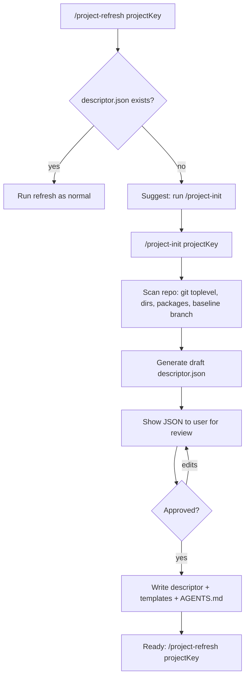
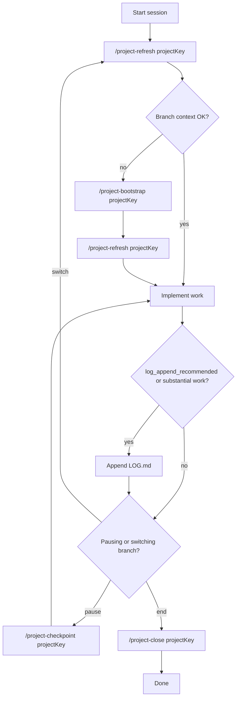
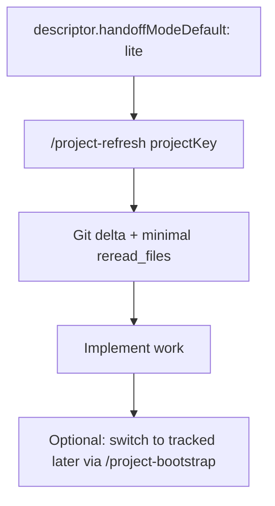

# OpenCode Handoff Kit (Reusable)

Reusable, **descriptor-driven** handoff kit for OpenCode: branch-local context outside the repo, **tracked** vs **lite** modes, optional `**MR.md`**, richer refresh metadata, **lifecycle commands** (no hooks), and optional **per-role model** hints.

## What this repo is for

- Branch-level context: `MERGE_REQUEST.md`, optional `MR.md`, `LOG.md`, optional `PHASES.md` under `~/.config/opencode/projects/<projectKey>/branches/<branch-name>/`
- Command templates: `/project-*`, `/manual-refresh`, plus **checkpoint / close / cleanup / knowledge**
- Bun tools: `opencode_bootstrap_branch`, `opencode_refresh_context` (optional if tool-calling is unstable)

## Quick start

1. **Pull latest** from GitHub, then copy kit assets into your OpenCode home:
  - `rules/*` → `~/.config/opencode/rules/`
  - `commands/*` → `~/.config/opencode/commands/`
  - `tools/*` → `~/.config/opencode/tools/` (when tool-calling is stable)
2. Create `**descriptor.json`** (choose one):
  - **Guided**: run `/project-init <projectKey>` — scans repo, drafts descriptor, you approve
  - **Manual**: copy `[descriptors/descriptor.template.json](descriptors/descriptor.template.json)` to `~/.config/opencode/projects/<projectKey>/descriptor.json` and fill in
3. Copy branch templates:
  `templates/mr/*` → `~/.config/opencode/projects/<projectKey>/_templates/mr/`  
   (include optional `[templates/mr/MR.md](templates/mr/MR.md)` if you use `mrFilenames`.)
4. Update `**~/.config/opencode/opencode.json`**:
  - Include `[rules/HANDOFF_GENERIC.md](rules/HANDOFF_GENERIC.md)` in `instructions` (plus your project overlay rule if needed)
  - Allow `external_directory` for `~/.config/opencode/projects/**`
  - Register tools when provider path is stable

## Architecture

### Components


| Component           | Path                                                                                                           | Role                                                        |
| ------------------- | -------------------------------------------------------------------------------------------------------------- | ----------------------------------------------------------- |
| Descriptor template | `[descriptors/descriptor.template.json](descriptors/descriptor.template.json)`                                 | Schema baseline                                             |
| Example descriptor  | `[descriptors/examples/example-project.descriptor.json](descriptors/examples/example-project.descriptor.json)` | Filled-in reference                                         |
| Engine              | `[tools/_opencode_engine.ts](tools/_opencode_engine.ts)`                                                       | Bootstrap + refresh logic                                   |
| Tool wrappers       | `[tools/opencode_*.ts](tools/)`                                                                                | OpenCode plugin interface                                   |
| Commands            | `[commands/](commands/)`                                                                                       | Slash-command markdown templates                            |
| Branch templates    | `[templates/mr/*](templates/mr/)`                                                                              | `MERGE_REQUEST.md`, `LOG.md`, optional `PHASES.md`, `MR.md` |
| Rule baseline       | `[rules/HANDOFF_GENERIC.md](rules/HANDOFF_GENERIC.md)`                                                         | MUST/SHOULD behavioral contract                             |
| Presentations       | `[docs/presentations/](docs/presentations/)`                                                                   | Teammate deck                                               |


### Disk layout (per project)

```
~/.config/opencode/projects/<projectKey>/
  descriptor.json
  AGENTS.md                        ← project-level shared knowledge
  <area>/AGENTS.md                 ← area-level shared knowledge
  packages/<pkg>/AGENTS.md         ← optional package knowledge
  _templates/mr/
    MERGE_REQUEST.md
    LOG.md
    PHASES.md
    MR.md                          ← optional
  branches/<branch-name>/
    MERGE_REQUEST.md
    MR.md                          ← optional
    LOG.md
    PHASES.md                      ← optional
```

### Descriptor responsibilities

- `projectRootPath`, `opencodeProjectRootPath`, `baselineBranchForMaterialChanges`
- `handoffModeDefault`: `tracked` | `lite`
- `areas` and optional `trackedKnowledgeTargets`
- `branchHandoff`: templates, filenames, optional `**mrFilenames**` (ordered; first existing MR wins for primary read), `checkpointField`
- `refreshToolHeuristics` for `mr_update_recommended`
- `subtaskModels`: optional map of role → `provider/model` string

## Handoff modes


| Mode                  | When to use                          | Branch files                                | Refresh if files missing                           |
| --------------------- | ------------------------------------ | ------------------------------------------- | -------------------------------------------------- |
| **tracked** (default) | Long branches, MR workflow, handoffs | MR (+ optional MR.md), LOG, optional PHASES | `missing_branch_context` → bootstrap               |
| **lite**              | Quick fixes, spikes, low-risk        | Optional                                    | Git window + minimal reread; no bootstrap required |


Set `handoffModeDefault` in `descriptor.json` to `lite` or `tracked`. Override per call by passing `handoffMode` to `opencode_refresh_context`.

## Workflows

### First-time project setup (`/project-init`)




### Tracked workflow




### Lite workflow




## Commands


| Command                                    | Purpose                                                                                               |
| ------------------------------------------ | ----------------------------------------------------------------------------------------------------- |
| `/project-init <projectKey>`               | **First-time setup**: scan repo, draft descriptor.json, present for approval, write project structure |
| `/project-refresh <projectKey>`            | Sync context; returns `changed_areas`, `reread_files`, nudges. Auto-suggests init if no descriptor    |
| `/project-bootstrap <projectKey>`          | Seed tracked branch files (asks phases yes/no)                                                        |
| `/project-phases <projectKey>`             | Create or refine `PHASES.md`                                                                          |
| `/project-checkpoint <projectKey>`         | Append checkpoint to `LOG.md`                                                                         |
| `/project-close <projectKey>`              | Session-close summary in `LOG.md`                                                                     |
| `/project-review <projectKey>`             | Generate review artifact (checklist, diff summary, or both — user chooses)                            |
| `/project-cleanup-candidates <projectKey>` | Stale `branches/`* report (read-only)                                                                 |
| `/project-knowledge-refresh <projectKey>`  | Propose durable knowledge updates (user approves)                                                     |
| `/manual-refresh <projectKey>`             | No tool-calling; merges bootstrap+refresh behavior when needed                                        |


Examples: `/project-init myapp`, `/project-refresh myapp`, `/project-close myapp`

For **when to use which command** and model binding, see `[COMMAND_WORKFLOW.md](COMMAND_WORKFLOW.md)`.

## Refresh tool output

Successful refresh JSON includes:

- `handoff_mode`, `branch`, `area`, `checkpoint_commit`, `head_commit`, `checkpoint_source`
- `changed_areas`, `changed_files_preview`, `reread_files`
- `mr_context_path`, `mr_context_paths`, `log_context_path`, `phases_context_path`
- `last_log_age_minutes`, `needs_checkpoint`, `context_staleness`
- `log_append_recommended`, `mr_update_recommended`, `agents_stale_vs_branch`
- `subtaskModels` (echo of descriptor map for agents to pick models)

On failure: `reason` + `recommended_next_step` (e.g. `descriptor_not_found` → `project_init`).

## Optional `MR.md`

If `branchHandoff.mrFilenames` lists `MR.md` after `MERGE_REQUEST.md`, bootstrap seeds a short **goals / deliverables** file from `[templates/mr/MR.md](templates/mr/MR.md)`. Refresh reads every existing MR file in order.

## Per-subtask models

OpenCode `opencode.json` supports per-command `model` and `subtask`. The descriptor may include `subtaskModels` (`refresh`, `bootstrap`, `checkpoint`, `close`, `knowledge`) as documentation for which model ID to bind.

Example `opencode.json` snippet:

```json
{
  "command": {
    "project-refresh": {
      "template": "~/.config/opencode/commands/project-refresh.md",
      "description": "Refresh handoff context",
      "subtask": true,
      "model": "your-provider/your-small-model"
    },
    "project-knowledge-refresh": {
      "template": "~/.config/opencode/commands/project-knowledge-refresh.md",
      "description": "Propose durable knowledge updates",
      "subtask": true,
      "model": "your-provider/your-strong-model"
    }
  }
}
```

## Manual mode (tools disabled)

When tools are in `tools-off/` or disabled, `/manual-refresh` is your single entry point. It **replaces both** `/project-refresh` and `/project-bootstrap`:

- Seeds branch files from templates if missing (tracked mode)
- Reads all context layers
- Computes git delta
- Returns the same structured `## Handoff refresh result` block

All other commands (`/project-init`, `/project-checkpoint`, `/project-close`, `/project-review`, `/project-cleanup-candidates`, `/project-phases`, `/project-knowledge-refresh`) work without tools — they only read/write files.

Fallback sentence (if `/manual-refresh` doesn't parse):

`Tool-calling is disabled. Run manual handoff refresh for project key <projectKey> using branch context files and git delta, then return branch, checkpoint->head, changed_areas, reread_files, and recommendations.`

## Template authoring

- Keep templates generic; use placeholders like `<branch-name>`.
- Keep `LOG.md` append-only and checkpoint-aware (`reviewed_through`).
- Keep `PHASES.md` optional.

## Bedrock / provider caveat

If you see `toolSpec.description` validation errors, switch to **manual mode** and disable tool permissions until the provider path is stable. See upstream [OpenCode PR #15957](https://github.com/anomalyco/opencode/pull/15957).