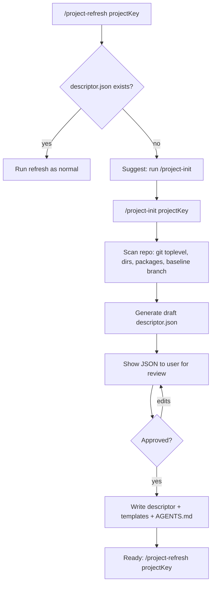
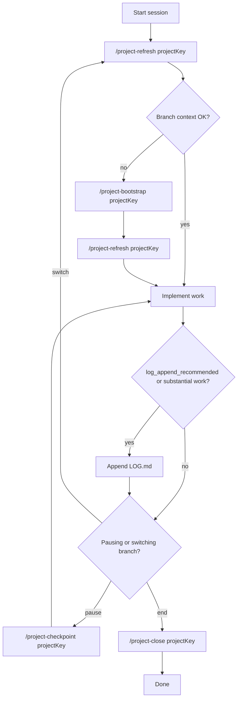
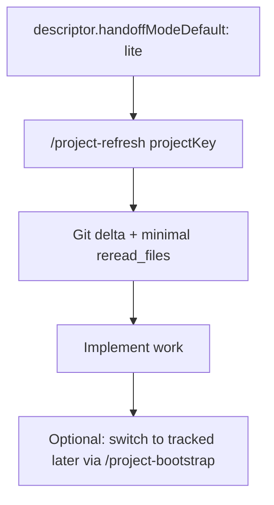

# OpenCode Conductor

A descriptor-driven toolkit that **conducts** your AI coding sessions in OpenCode:

- **Conducts the agent's behavior** — rules enforce conventions, prevent mistakes, and ensure clean code
- **Conducts the workflow** — commands and skills orchestrate session lifecycle, verification, and refactoring
- **Conducts the model orchestra** — routes Haiku, Sonnet, and Opus to the right tasks for optimal cost/quality

Branch-local context (default **under `~/.config`**, or **beside the clone** when you choose project-local in `/project-init`), **tracked** vs **lite** modes, optional `MR.md`, richer refresh metadata, **lifecycle commands** (no hooks), and **per-role model** routing.

## What this repo is for

- Branch-level context: `MERGE_REQUEST.md`, optional `MR.md`, `LOG.md`, optional `PHASES.md` under `~/.config/opencode/projects/<projectKey>/branches/<branch-name>/`
- Command templates: `/project-*`, `/manual-refresh`, plus **checkpoint / close / cleanup / knowledge**
- Bun tools: `opencode_bootstrap_branch`, `opencode_refresh_context` (optional if tool-calling is unstable)

## Docs map

- [`README.md`](README.md) — canonical guide (architecture, workflows, commands, rules, skills, cost analysis)
- [`WORKFLOW.md`](WORKFLOW.md) — **canonical** step-by-step scenarios (init, tracked vs lite, sessions, verification, knowledge, **review**, skills, Mermaid diagrams); start here for ordered procedures
- [`COMMAND_WORKFLOW.md`](COMMAND_WORKFLOW.md) — quick command decision matrix
- [`TEST_PLAN.md`](TEST_PLAN.md) — smoke test checklist
- [`CHANGELOG.md`](CHANGELOG.md) — notable kit changes (read after every `git pull`)
- [`docs/UPGRADING.md`](docs/UPGRADING.md) — stale clone catch-up, global vs project-local migration
- [`SECURITY.md`](SECURITY.md) — vulnerability reporting + operator checklist
- [`docs/PATH_CONTRACT.md`](docs/PATH_CONTRACT.md) — how tools resolve `descriptor.json` vs branch paths
- [`CHANGELOG-v2.md`](CHANGELOG-v2.md) — v1 to Conductor evolution notes
- [`docs/presentations/`](docs/presentations/) — teammate-facing deck assets

## Quick start

```bash
git clone <repo>
cd opencode-conductor
bash bin/install-opencode-conductor.sh
# or to preview only:
bash bin/install-opencode-conductor.sh --dry-run
```

Re-run `bash bin/install-opencode-conductor.sh` after each `git pull` so `~/.config/opencode/` stays in sync with kit updates.

**Updating the kit:** `cd` into the clone you use as install source, `git pull`, run `bash bin/install-opencode-conductor.sh`, restart OpenCode if slash-commands look stale. If `CHANGELOG.md` marks **BREAKING**, read [`docs/UPGRADING.md`](docs/UPGRADING.md) before merging descriptor or `opencode.json` changes.

Teams that maintain a **private downstream fork** should `git pull` and install from **that fork** so org-tuned commands stay consistent (upstream README stays vendor-neutral).

1. **Pull latest** from GitHub, then copy kit assets into your OpenCode home:
  - `rules/*` → `~/.config/opencode/rules/`
  - `commands/*` → `~/.config/opencode/commands/`
  - `skills/*` → `~/.config/opencode/skills/`
  - `tools/*` → `~/.config/opencode/tools/` (when tool-calling is stable)
2. Create `**descriptor.json`** (choose one):
  - **Guided**: run `/project-init <projectKey>` — scans repo, drafts descriptor, you approve
  - **Manual**: copy `[descriptors/descriptor.template.json](descriptors/descriptor.template.json)` to `~/.config/opencode/projects/<projectKey>/descriptor.json` and fill in
3. Copy branch templates:
  `templates/mr/*` → `~/.config/opencode/projects/<projectKey>/_templates/mr/`  
   (include optional `[templates/mr/MR.md](templates/mr/MR.md)` if you use `mrFilenames`.)
4. Update `**~/.config/opencode/opencode.json`**:
  - Include `[rules/HANDOFF_GENERIC.md](rules/HANDOFF_GENERIC.md)` in `instructions` (plus your project overlay rule if needed)
  - Allow `external_directory` for `~/.config/opencode/projects/**`
  - Register tools when provider path is stable

### Local OpenCode home hygiene (upgrading from v1 or ad-hoc setups)

When aligning an existing `~/.config/opencode/` with this kit, prefer **review + diff** over blind overwrite. **Never commit** API keys or tokens from `opencode.json`.

**Typical legacy layout (what to fix):**

- **Rules**: only `HANDOFF.md` (or one monolithic handoff file) — add [`rules/HANDOFF_GENERIC.md`](rules/HANDOFF_GENERIC.md) and keep `HANDOFF.md` as a **thin project overlay** (tool names, package detection, org conventions).
- **Commands**: only refresh/bootstrap/phases/manual — replace the whole `commands/` folder from this repo so new lifecycle, verification, review, init, and scaffold commands exist.
- **Stale paths under `~/.config/opencode/`** (safe to remove once you use kit commands + README): redundant top-level runbooks such as `COMMAND_WORKFLOW.md`, `OPENCODE_HANDOFF_GENERIC.md`, `OPENCODE_HANDOFF_<PROJECT>.md` if you still have copies there.
- **Wrong skills location**: delete `~/.config/opencode/projects/<projectKey>/skills/` — procedural guides belong in OpenCode’s global [`skills/`](skills/) (or this kit’s `skills/`), not under a project folder.
- **Descriptor drift**: ensure `handoffModeDefault` is set; use `mrFilenames` (array) instead of legacy `mrFilename` (string); add `subtaskModels` (can start as `{}`); add optional `MR.md` to `mrFilenames` only if you copy [`templates/mr/MR.md`](templates/mr/MR.md) into `_templates/mr/`.
- **Tools**: if you keep plugins disabled, a `tools-off/` folder is fine — move wrappers back to `tools/` when provider/tool-calling is stable (see [Manual mode (tools disabled)](#manual-mode-tools-disabled) below).

**Suggested order:** copy `commands/` → layer `HANDOFF_GENERIC.md` + trim overlay → delete stale files above → upgrade descriptor fields → register commands/models in `opencode.json`.

## Architecture

### Components


| Component           | Path                                                                                                           | Role                                                        |
| ------------------- | -------------------------------------------------------------------------------------------------------------- | ----------------------------------------------------------- |
| Descriptor template | `[descriptors/descriptor.template.json](descriptors/descriptor.template.json)`                                 | Schema baseline                                             |
| Example descriptor  | `[descriptors/examples/example-project.descriptor.json](descriptors/examples/example-project.descriptor.json)` | Filled-in reference                                         |
| Engine              | `[tools/_opencode_engine.ts](tools/_opencode_engine.ts)`                                                       | Bootstrap + refresh logic                                   |
| Tool wrappers       | `[tools/opencode_*.ts](tools/)`                                                                                | OpenCode plugin interface                                   |
| Commands            | `[commands/](commands/)`                                                                                       | Slash-command markdown templates                            |
| Branch templates    | `[templates/mr/*](templates/mr/)`                                                                              | `MERGE_REQUEST.md`, `LOG.md`, optional `PHASES.md`, `MR.md` |
| Workflow scenarios  | [`WORKFLOW.md`](WORKFLOW.md)                                                                                    | Step-by-step review / MR / handoff flows |
| Rule baseline       | `[rules/HANDOFF_GENERIC.md](rules/HANDOFF_GENERIC.md)`                                                         | MUST/SHOULD behavioral contract                             |
| Code quality rule   | `[rules/CODE_QUALITY.md](rules/CODE_QUALITY.md)`                                                               | Universal quality standards                                 |
| Frontend rule       | `[rules/FRONTEND.md](rules/FRONTEND.md)`                                                                       | Base frontend conventions                                   |
| Skills              | `[skills/](skills/)`                                                                                           | On-demand workflow guides (OpenCode native)                 |
| Presentations       | `[docs/presentations/](docs/presentations/)`                                                                   | Teammate deck                                               |


### Where does handoff state live?

| Layout | `descriptor.json` on disk | Branch folders + `AGENTS.md` trees | Typical `.gitignore` |
| ------ | ------------------------- | ----------------------------------- | --------------------- |
| **Global (default)** | `~/.config/opencode/projects/<projectKey>/descriptor.json` | Same tree under that directory | N/A (outside repo) |
| **Project-local** | Still **`~/.config/.../descriptor.json`** (kit tool contract) | Paths inside **`<git-root>/.opencode-conductor/`** (or `.opencode/`) per [`docs/PATH_CONTRACT.md`](docs/PATH_CONTRACT.md) | **Default:** ignore `<dir>/` so internal narrative is not committed |

**Who sees handoff after `git clone`?**

- **Global:** new clone has **no** branch state until you bootstrap on that machine; state stays in your home dir.
- **Project-local + gitignored:** same as global for clones — empty `<dir>/` until bootstrap; CI does not see handoff files.
- **Project-local + committed:** everyone with repo access sees files; mind **classification**, **secrets**, and **merge conflicts** on `LOG.md` / `REVIEW.md`.

Use **`/project-init`** to pick global vs project-local and the `.gitignore` tri-state. Long risk explanations stay in this README and [`WORKFLOW.md`](WORKFLOW.md), not in the init wall-of-text.

### Disk layout (per project)

**Global layout** (canonical example — paths always come from your `descriptor.json`):

```
~/.config/opencode/projects/<projectKey>/
  descriptor.json
  AGENTS.md                        ← project-level shared knowledge (same for all branches)
  <area>/AGENTS.md                 ← area-level shared knowledge
  packages/<pkg>/AGENTS.md         ← optional package knowledge
  branches/<branch-name>/          ← per-branch: created on bootstrap; one folder per Git branch
    MERGE_REQUEST.md
    MR.md                          ← optional
    LOG.md
    PHASES.md                      ← optional
    REVIEW.md                      ← optional (from /project-review)
  _templates/mr/
    MERGE_REQUEST.md
    LOG.md
    PHASES.md
    MR.md                          ← optional
```

**Project-local layout** (same filenames; root is `<git-root>/.opencode-conductor/` by default):

```
<git-root>/.opencode-conductor/
  AGENTS.md
  <area>/AGENTS.md
  branches/<branch-name>/...
  _templates/mr/...
```

### Descriptor responsibilities

- `projectRootPath`, `opencodeProjectRootPath`, `baselineBranchForMaterialChanges`
- `handoffModeDefault`: `tracked` | `lite`
- `areas` and optional `trackedKnowledgeTargets`
- `branchHandoff`: templates, filenames, optional `**mrFilenames**` (ordered; first existing MR wins for primary read), `checkpointField`
- `refreshToolHeuristics` for `mr_update_recommended`
- `subtaskModels`: optional map of role → `provider/model` string

**UI base URLs** for reviewers belong in **`MERGE_REQUEST.md`** (`## Verification target`) and/or repo `README` — [`/project-review`](commands/project-review.md) folds a single optional **`Base URL (manual):`** line into `## How to verify` (see command). No descriptor fields are required for URLs.

## Handoff modes


| Mode                  | When to use                          | Branch files                                | Refresh if files missing                           |
| --------------------- | ------------------------------------ | ------------------------------------------- | -------------------------------------------------- |
| **tracked** (default) | Long branches, MR workflow, handoffs | MR (+ optional MR.md), LOG, optional PHASES | `missing_branch_context` → bootstrap               |
| **lite**              | Quick fixes, spikes, low-risk        | Optional                                    | Git window + minimal reread; no bootstrap required |


Set `handoffModeDefault` in `descriptor.json` to `lite` or `tracked`. Override per call by passing `handoffMode` to `opencode_refresh_context`.

## Workflows

### First-time project setup (`/project-init`)




### Tracked workflow




### Lite workflow




## Commands

### Handoff lifecycle

| Command                                    | Purpose                                                                                               |
| ------------------------------------------ | ----------------------------------------------------------------------------------------------------- |
| `/project-init <projectKey>`               | **First-time setup**: scan repo, draft descriptor.json, present for approval, write project structure |
| `/project-refresh <projectKey>`            | Sync context; returns `changed_areas`, `reread_files`, nudges. Auto-suggests init if no descriptor    |
| `/project-bootstrap <projectKey>`          | Seed tracked branch files (asks phases yes/no; can ingest pasted MR/issue/testing text into narrative sections) |
| `/project-phases <projectKey>`             | Create or refine `PHASES.md`                                                                          |
| `/project-checkpoint <projectKey>`         | Append checkpoint to `LOG.md`                                                                         |
| `/project-close <projectKey>`              | Session-close summary in `LOG.md`                                                                     |
| `/project-review <projectKey>`             | Generate `REVIEW.md` (checklist review, diff-first review, or checklist + diff; findings table with `F-xx` ids; preserve/replace triage; optional appendix; optional reviewer context) |
| `/project-review-sync <projectKey>`        | Light refresh: merge MR deltas into `REVIEW.md` checklist, optional new `F-xx` rows (preserve triage), refresh MR **`OpenCode:`** blocks, **and ingest pasted semi-structured MR/issue/testing context (scope D)** into protected MR narrative sections — not a full regenerate |
| `/project-update-mr <projectKey>`          | Update `MERGE_REQUEST.md` from git facts + branch context; refreshes canonical **`## OpenCode:`** machine blocks (in-place merge / append / regenerate) and supports paste-ingest of semi-structured MR/issue/testing text via option **D** |
| `/project-cleanup-candidates <projectKey>` | Stale `branches/`* report (read-only)                                                                 |
| `/project-knowledge-refresh <projectKey>`  | Propose durable knowledge updates (user approves)                                                     |
| `/scaffold-knowledge <projectKey>`         | **Once after init:** scaffold shared `AGENTS.md` (not per-branch). Optional re-run when areas/packages/stack change |
| `/manual-refresh <projectKey>`             | No tool-calling; merges bootstrap+refresh behavior when needed                                        |

### Verification

| Command              | Purpose                                                      |
| -------------------- | ------------------------------------------------------------ |
| `/check-types [area]` | Run the area's type checker and report errors               |
| `/run-tests [area]`   | Run the appropriate test suite for changed/specified areas   |
| `/lint-fix [area]`    | Run linter with auto-fix, report remaining issues           |
| `/organize-imports`   | Sort, group, and clean up imports in changed files           |

Examples: `/project-init myapp`, `/project-refresh myapp`, `/check-types front-end`

### Use cases → what to run

**Full catalog** (init, phases, tracked loop, lite mode, review, skills, diagrams): **[`WORKFLOW.md`](WORKFLOW.md)** — that file is the single source of truth for ordered procedures; this table is only **quick picks**.

| I want to… | Run or read |
| ----------- | ----------- |
| **Everything else** (“how do I…?”) | Open **[`WORKFLOW.md`](WORKFLOW.md)** TOC |
| Start a new session on an existing branch | `/manual-refresh` or `/project-refresh` |
| First-time project on this kit | `/project-init` → `/scaffold-knowledge` (see **WORKFLOW §2**) |
| Long-lived branch / checkpoints / MR sync | **WORKFLOW §3**; `/project-checkpoint`, `/project-update-mr` |
| Review before merge | `/manual-refresh` → `/project-review` (**WORKFLOW §9**); optional `review-branch` skill |
| Light sync after MR edits or new commits | `/project-review-sync` |
| Ingest pasted MR/issue/testing text into MR narrative | `/project-update-mr` (option **D**) or `/project-review-sync` (option **D**) |
| Refresh MR `OpenCode:` machine blocks from facts | `/project-update-mr` |
| Types / tests / lint only | `/check-types`, `/run-tests`, `/lint-fix` |
| Read last session without refresh | `branches/<branch>/LOG.md` |

### Lightweight workflows (no refresh needed)

Not every session requires a full refresh. Use these shortcuts for quick interactions:

**Just read context:**
- Open **`LOG.md`** on the branch: resolve `branchHandoff.contextDirTemplate` from `descriptor.json` (default global example: `~/.config/opencode/projects/<key>/branches/<branch>/LOG.md`)
- Open **`MERGE_REQUEST.md`** in that same branch folder for objectives
- Open **`PHASES.md`** there if used

**Just verify code:**
- `/check-types` — works standalone, detects area from cwd
- `/run-tests` — works standalone, detects area from cwd
- `/lint-fix` — works standalone, detects area from cwd
- `/organize-imports` — works standalone

**Just record progress:**
- `/project-checkpoint` — appends to LOG.md without needing a prior refresh

**When to do a full refresh:**
- First session of the day (context may be stale)
- After switching branches
- After a rebase or merge from main
- Before a code review
- When `LOG.md` is more than a day old

For **command model binding**, see `[COMMAND_WORKFLOW.md](COMMAND_WORKFLOW.md)`.

## Rules

The kit includes optional, universally-applicable rules that any project can adopt:

| Rule | Purpose |
| ---- | ------- |
| `rules/HANDOFF_GENERIC.md` | Behavioral contract for the handoff system (MUST/SHOULD) |
| `rules/CODE_QUALITY.md` | Control flow, naming, TypeScript, testing, error handling best practices |
| `rules/FRONTEND.md` | Base frontend conventions: imports, boundaries, React, TypeScript typing |

Add them to your `opencode.json` `instructions` array:

```json
{
  "instructions": [
    "~/.config/opencode/rules/HANDOFF_GENERIC.md",
    "~/.config/opencode/rules/CODE_QUALITY.md",
    "~/.config/opencode/rules/FRONTEND.md"
  ]
}
```

Project-specific rules (e.g. framework conventions, custom patterns) should layer on top of these in your own project overlay.

## Skills

Skills are on-demand workflow guides loaded via OpenCode's native `skill` tool. They cost **zero context tokens** until the agent decides to load one.

### How skills work

1. OpenCode discovers all `~/.config/opencode/skills/*/SKILL.md` files at startup
2. The agent sees a list of skill names + descriptions in its tool definition
3. When the agent encounters a task matching a skill's description, it calls `skill({ name: "..." })` to load the full instructions
4. The agent follows the loaded instructions in its current context

Skills are NOT loaded unless relevant — unlike rules which are always present.

### Available skills

| Skill | Agent loads it when... | What it does |
| ----- | ---------------------- | ------------ |
| `review-branch` | User asks to review a branch, or says "check before merge" | Orchestrates: `/manual-refresh` → `/project-review` → optional verification → optional `/project-update-mr` or `/project-review-sync` (see skill) |
| `session-lifecycle` | User starts/ends a session, or asks "how should I checkpoint?" | Guides the refresh → work → checkpoint → close flow with decision points |
| `onboard-area` | User asks about unfamiliar code, or agent needs to understand a new area before making changes | Reads AGENTS.md hierarchy, scans key files, builds a mental model |
| `verify-changes` | User says "check if everything works" or "verify my changes" | Decision tree: detect areas → type-check → test → lint, reports combined result |
| `systematic-debugging` | A bug is reported or a test fails unexpectedly | Guides binary search isolation, minimal reproduction, root cause analysis |
| `refactor-safely` | User asks to refactor, restructure, or move code | Step-by-step safe refactoring with verification at each step |
| `write-tests` | User asks to add tests, or code has no coverage | Guides: what to test → test type selection → assertion writing |

### Installation

Copy the `skills/` folder to `~/.config/opencode/skills/`:

```bash
cp -r skills/* ~/.config/opencode/skills/
```

Each skill follows OpenCode's discovery format: `skills/<name>/SKILL.md` with YAML frontmatter (`name` + `description` required).

### Permissions (optional)

Control skill access in `opencode.json`:

```json
{
  "permission": {
    "skill": {
      "*": "allow"
    }
  }
}
```

## Refresh tool output

Successful refresh JSON includes:

- `handoff_mode`, `branch`, `area`, `checkpoint_commit`, `head_commit`, `checkpoint_source`
- `changed_areas`, `changed_files_preview`, `reread_files`
- `mr_context_path`, `mr_context_paths`, `log_context_path`, `phases_context_path`
- `last_log_age_minutes`, `needs_checkpoint`, `context_staleness`
- `log_append_recommended`, `mr_update_recommended`, `agents_stale_vs_branch`
- `subtaskModels` (echo of descriptor map for agents to pick models)

On failure: `reason` + `recommended_next_step` (e.g. `descriptor_not_found` → `project_init`).

## Optional `MR.md`

If `branchHandoff.mrFilenames` lists `MR.md` after `MERGE_REQUEST.md`, bootstrap seeds a short **goals / deliverables** file from `[templates/mr/MR.md](templates/mr/MR.md)`. Refresh reads every existing MR file in order.

## Per-subtask models

OpenCode `opencode.json` supports per-command `model` and `subtask`. The descriptor may include `subtaskModels` (`refresh`, `bootstrap`, `checkpoint`, `close`, `knowledge`) as documentation for which model ID to bind.

Example `opencode.json` snippet:

```json
{
  "command": {
    "project-refresh": {
      "template": "~/.config/opencode/commands/project-refresh.md",
      "description": "Refresh handoff context",
      "subtask": true,
      "model": "your-provider/your-small-model"
    },
    "project-knowledge-refresh": {
      "template": "~/.config/opencode/commands/project-knowledge-refresh.md",
      "description": "Propose durable knowledge updates",
      "subtask": true,
      "model": "your-provider/your-strong-model"
    }
  }
}
```

## Manual mode (tools disabled)

When tools are in `tools-off/` or disabled, `/manual-refresh` is your single entry point. It **replaces both** `/project-refresh` and `/project-bootstrap`:

- Seeds branch files from templates if missing (tracked mode)
- Reads all context layers
- Computes git delta
- Returns the same structured `## Handoff refresh result` block

All other commands (`/project-init`, `/project-checkpoint`, `/project-close`, `/project-review`, `/project-cleanup-candidates`, `/project-phases`, `/project-knowledge-refresh`) work without tools — they only read/write files.

Fallback sentence (if `/manual-refresh` doesn't parse):

`Tool-calling is disabled. Run manual handoff refresh for project key <projectKey> using branch context files and git delta, then return branch, checkpoint->head, changed_areas, reread_files, and recommendations.`

## Template authoring

- Keep templates generic; use placeholders like `<branch-name>`.
- Keep `LOG.md` append-only and checkpoint-aware (`reviewed_through`).
- Keep `PHASES.md` optional.

## Token cost analysis

The kit is designed to minimize token usage while maximizing agent productivity.

### What's always in context (every message)

| Layer | ~Tokens | Purpose |
|-------|---------|---------|
| Rules (loaded via `instructions`) | ~4,500-6,000 | Prevents mistakes, eliminates correction loops |
| opencode.json config | ~1,300 | Command routing, permissions |
| **Total always-on** | **~6,000-7,500** | |

### What's loaded on-demand (zero cost until invoked)

| Layer | ~Tokens each | When loaded |
|-------|-------------|-------------|
| Commands (subtask) | ~350-700 | Only the ONE invoked command loads, in a separate subtask context |
| Skills | ~500-850 | Only when the agent decides the task matches |

### Cost savings mechanisms

| Mechanism | How it saves |
|-----------|-------------|
| **Model routing** | Haiku ($0.25/M) handles routine commands; Opus ($15/M) reserved for synthesis only — 60x cheaper per subtask |
| **Subtask isolation** | Commands run in their own context, don't bloat the main conversation |
| **Skills on-demand** | ~28KB of workflow guides NOT in context unless needed |
| **Rules prevent mistakes** | ~6K tokens of rules prevents 30-60K tokens of correction loops (5-10x ROI) |
| **Structured refresh output** | Agent gets exactly what it needs — fewer random tool calls and file reads |
| **Lite mode** | Skip branch files for quick sessions — saves bootstrap + file reads |
| **Lightweight workflows** | Skip refresh entirely for verify-only sessions |

### Estimated savings per session

| Session type | Without kit | With kit | Savings |
|-------------|-------------|----------|---------|
| Quick lint fix (5 messages) | ~$0.50 | ~$0.35 | ~30% |
| Feature development (30 messages) | ~$4.50 | ~$3.00 | ~33% |
| Full code review (15 messages) | ~$2.50 | ~$1.50 | ~40% |

### Best practices to minimize cost

1. **Use lite mode** for quick sessions — skip branch file overhead
2. **Use lightweight workflows** — `/check-types` directly instead of full refresh + check
3. **Let Haiku handle routine tasks** — refresh, checkpoint, lint, types are all Haiku-routed
4. **Use skills instead of asking** — skill-guided workflows are more efficient than multi-turn conversations
5. **Keep rules concise** — stay under 30KB total; prune rules that overlap

## Bedrock / provider caveat

If you see `toolSpec.description` validation errors, switch to **manual mode** and disable tool permissions until the provider path is stable. See upstream [OpenCode PR #15957](https://github.com/anomalyco/opencode/pull/15957).