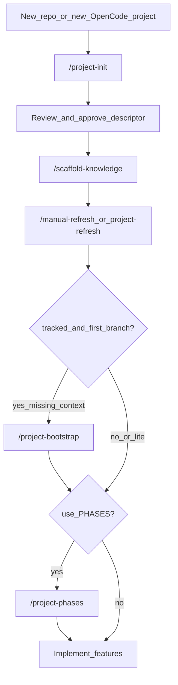
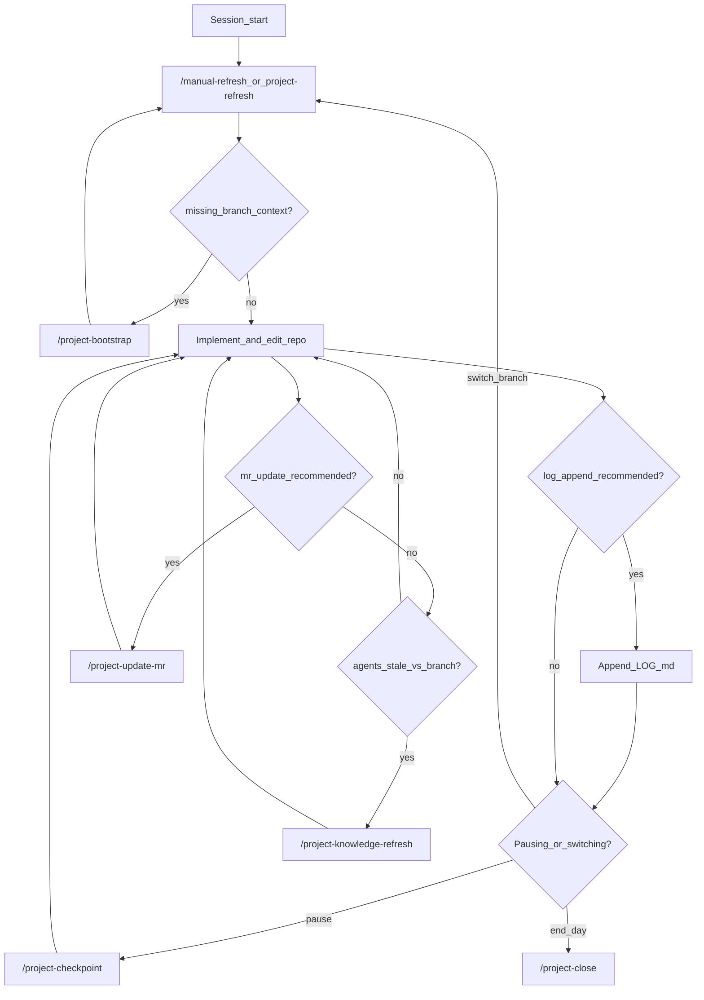
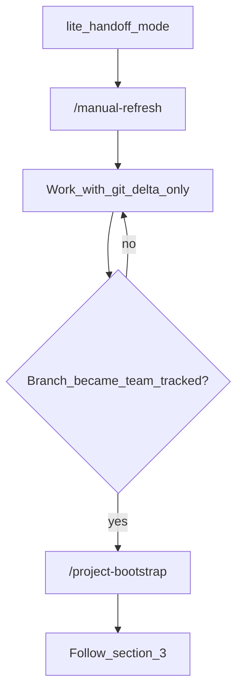
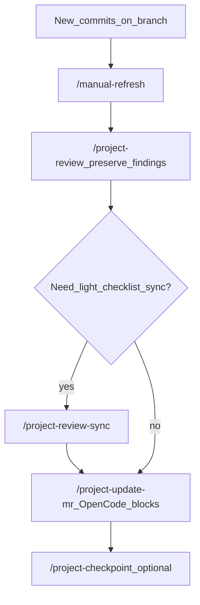
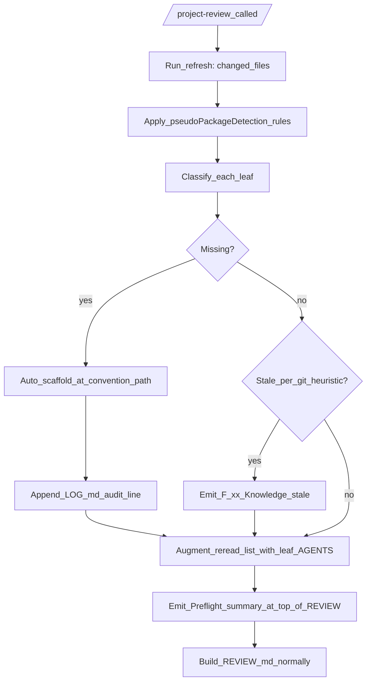
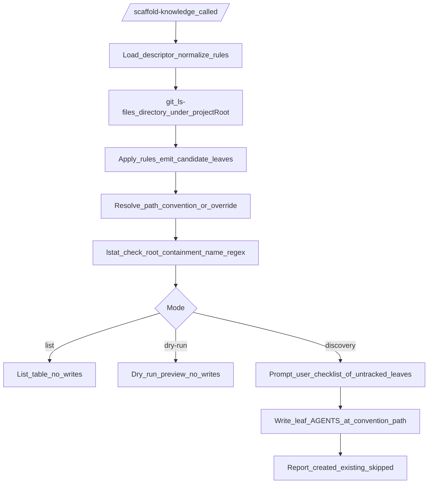
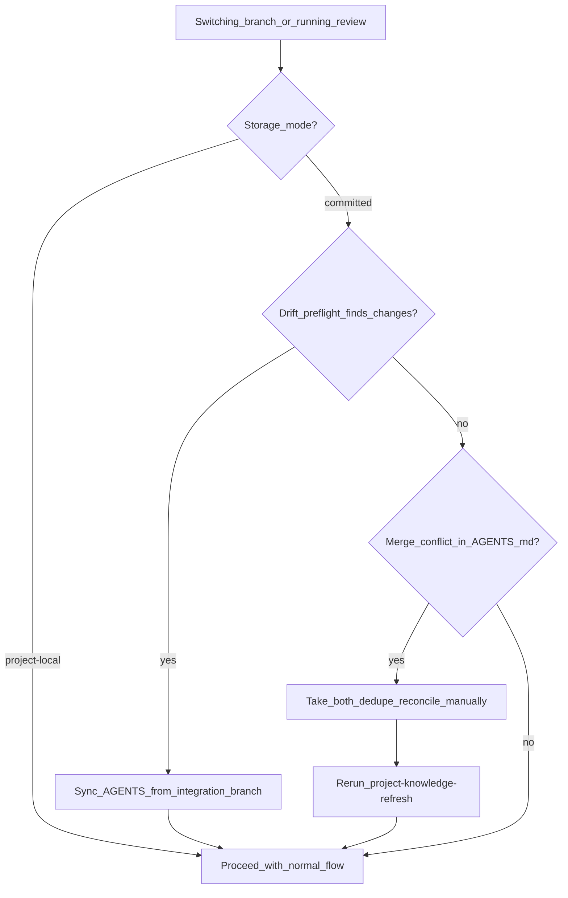
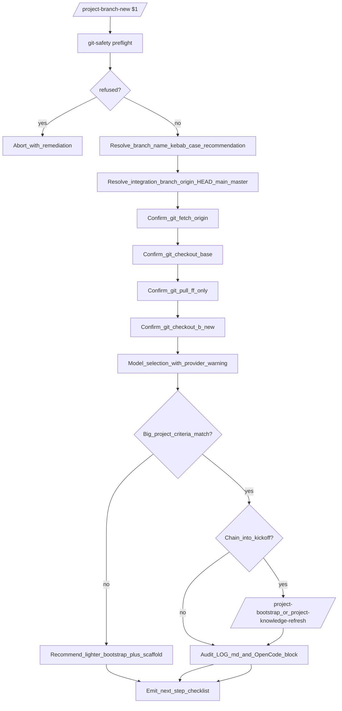
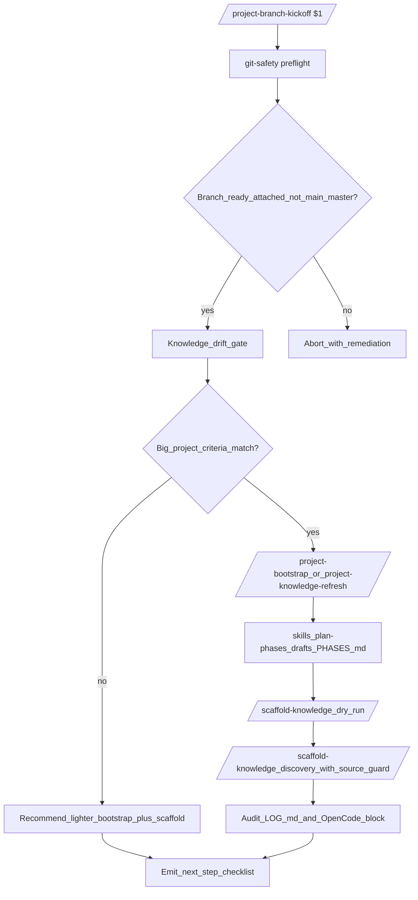

# OpenCode Conductor — workflow scenarios

**Canonical ordered procedures** for this kit. For **which slash command when**, see [`COMMAND_WORKFLOW.md`](COMMAND_WORKFLOW.md). For **install, descriptor fields, cost, rules list**, see [`README.md`](README.md).

Replace **`<projectKey>`** with your descriptor key. The descriptor file is always loaded from **`~/.config/opencode/projects/<projectKey>/descriptor.json`** by kit tools; branch folders and `AGENTS.md` paths are **whatever `branchHandoff` and `areas` say** (often the same global tree, or a **project-local** tree — see [`docs/PATH_CONTRACT.md`](docs/PATH_CONTRACT.md)).

## Table of contents

1. [How to use this doc](#1-how-to-use-this-doc)
2. [Initiating a project (first time)](#2-initiating-a-project-first-time)
3. [Working with a large / long-lived branch (tracked)](#3-working-with-a-large--long-lived-branch-tracked)
4. [Working with small branches (lite mode)](#4-working-with-small-branches-lite-mode)
5. [Starting on a branch (first visit)](#5-starting-on-a-branch-first-visit)
6. [Continuing in a new session](#6-continuing-in-a-new-session)
7. [Verification without full handoff](#7-verification-without-full-handoff)
8. [Knowledge and housekeeping](#8-knowledge-and-housekeeping)
9. [Reviewing](#9-reviewing)
10. [Using skills](#10-using-skills)
11. [Knowledge-aware review preflight](#11-knowledge-aware-review-preflight)
12. [Knowledge across branches](#12-knowledge-across-branches)
13. [Big branch kickoff](#13-big-branch-kickoff)
14. [Worked examples](#14-worked-examples)

---

## 1. How to use this doc

### State vs commands (control plane)

- **Artifacts (durable state)** live under the folder from **`branchHandoff.contextDirTemplate`** (see `descriptor.json`) and shared knowledge under **`opencodeProjectRootPath`** / **`areas.*.areaAgentsPath`**. Default global example: `~/.config/opencode/projects/<projectKey>/branches/<branch-name>/` with `MERGE_REQUEST.md`, `LOG.md`, optional `REVIEW.md`, optional `PHASES.md`, optional `MR.md`, plus `AGENTS.md` trees. Treat these as the **operational** record from Conductor; your org may still keep a canonical human MR narrative elsewhere.
- **Slash commands** are **operations** on that state: refresh context, append checkpoints, regenerate review artifacts, update MR machine blocks, etc. They do not replace reading the files when you need nuance.

### Handoff modes

- **`tracked`** (default in many descriptors): full branch folder, MR + LOG (+ optional PHASES). Heavier, best for long MRs and team handoff.
- **`lite`**: smaller branch footprint; `/manual-refresh` still gives git delta + minimal reread. Good for spikes and small fixes.

See `handoffModeDefault` in [`README.md`](README.md) (Descriptor responsibilities).

### Review glossary (cross-links)

- **`/project-review` artifact types** — use plain names: **Checklist review**, **Diff-first review**, **Checklist + diff (full)**. Details: [`commands/project-review.md`](commands/project-review.md).
- **`OpenCode:` headings** in `MERGE_REQUEST.md` — machine-updated blocks; details: [`commands/project-update-mr.md`](commands/project-update-mr.md).

---

## 2. Initiating a project (first time)

1. **`/project-init <projectKey>`** — scans the repo, drafts `descriptor.json`, you approve before it is written under `~/.config/opencode/projects/<projectKey>/` (always). Init also asks **global vs project-local** durable paths and optional `.gitignore` for repo-local dirs; see [`README.md`](README.md) and [`docs/PATH_CONTRACT.md`](docs/PATH_CONTRACT.md).
2. **`/scaffold-knowledge <projectKey>`** — once (or again when areas/stack change): shared `AGENTS.md` orientation, not per-branch.
3. **`/manual-refresh <projectKey>`** or **`/project-refresh <projectKey>`** — confirm project resolves; for **tracked**, expect branch context paths from refresh output.
4. **First visit to a Git branch (tracked):** if refresh reports missing branch context, **`/project-bootstrap <projectKey>`** (optionally seed `PHASES.md` and optionally paste MR/issue/testing context so narrative sections auto-fill). If you skip the paste at bootstrap, you can re-ingest later with **`/project-update-mr <projectKey>`** scope D or **`/project-review-sync <projectKey>`** scope D.
5. **Implement** in the repo; use **`/project-checkpoint`** when you pause.

### With phased delivery

After bootstrap (or once the branch is real), run **`/project-phases <projectKey>`** when milestones help: creates or refines `PHASES.md` for multi-step work.

### Without phased delivery

Skip **`/project-phases`**; use `MERGE_REQUEST.md` + `LOG.md` only.



---

## 3. Working with a large / long-lived branch (tracked)

Typical loop:

1. Start day or resume: **`/manual-refresh`** or **`/project-refresh`**.
2. If refresh says **`missing_branch_context`**: **`/project-bootstrap`**, then refresh again.
3. Implement; append **`LOG.md`** when refresh recommends or after substantial work.
4. Before breaks: **`/project-checkpoint`** with short bullets + optional user prompt (same message).
5. When MR facts drift: **`/project-update-mr`** (refreshes canonical `## OpenCode:` blocks; supports in-place merge, append, regenerate, and paste-ingest via option D). You can also use **`/project-review-sync`** scope D when you are syncing review artifacts at the same time — see [§9.10](#910-feed-in-semi-structured-mr-text-paste-ingest).
6. When shared knowledge is stale vs branch: **`/project-knowledge-refresh`** (proposal-first; you approve edits).
7. End of day: **`/project-close`** summary.



---

## 4. Working with small branches (lite mode)

1. Descriptor uses **`handoffModeDefault`: `lite`** (or override per refresh when supported).
2. Use **`/manual-refresh`** as the main entry; branch templates may be absent.
3. When the branch becomes “real” (MR workflow, reviewers, long life), **switch to tracked**: run **`/project-bootstrap`** then normal tracked flow (section 3).



---

## 5. Starting on a branch (first visit)

**Tracked**

1. **`/manual-refresh`** or **`/project-refresh`**.
2. If output indicates **missing branch folder** → **`/project-bootstrap`**, then refresh again.
3. Open `MERGE_REQUEST.md` and align title/goal if needed (human narrative); leave `## OpenCode:` blocks for commands.

**Already bootstrapped**

- Refresh only; edit branch files as usual.

---

## 6. Continuing in a new session

1. Open **`branches/<branch>/LOG.md`** — read last checkpoint and open questions.
2. **`/manual-refresh <projectKey>`** (or **`/project-refresh`**).
3. Tell the agent explicitly: branch name, last checkpoint summary, and what to do next (or load **`session-lifecycle`** skill — section 10).
4. If the branch uses **`PHASES.md`**, skim current phase before coding.

---

## 7. Verification without full handoff

Use when you only need quality signal:

- **`/check-types [area]`** — types.
- **`/run-tests [area]`** — tests.
- **`/lint-fix [area]`** — lint with fix.
- **`/organize-imports`** — import hygiene.

Still run **`/manual-refresh`** first if you **switched branches**, **rebased**, or context is **stale** (see [`README.md`](README.md) “When to do a full refresh”).

---

## 8. Knowledge and housekeeping

| Goal | Command |
|------|---------|
| Re-orient AGENTS after areas/packages change | **`/scaffold-knowledge`** (idempotent merge; seeds starter `## Verification scripts` in new area files) |
| Discover untracked leaves and scaffold them | **`/scaffold-knowledge <projectKey>`** (default discovery mode) |
| List currently tracked leaves | **`/scaffold-knowledge <projectKey> list`** |
| Preview what discovery would scaffold | **`/scaffold-knowledge <projectKey> dry-run`** |
| Propose durable AGENTS updates from branch learning | **`/project-knowledge-refresh`** |
| Auto-scaffold missing knowledge during review | **`/project-review`** (preflight, silent default) |
| List stale `branches/*` folders | **`/project-cleanup-candidates`** (read-only) |
| End session with summary | **`/project-close`** |

> **Knowledge audience.** `AGENTS.md` files are **dual-audience by design**: agents load them deterministically during refresh and review preflight; humans read them as onboarding and reference material. Authors should write for both — short, factual prose with concrete file paths, framework names, and verification steps.

> **Convention path for leaves.** With `descriptorSchemaVersion: 2`, leaf `AGENTS.md` files live at `<opencodeProjectRootPath>/<rel>/AGENTS.md`, where `<rel>` mirrors the leaf's path under `projectRootPath` (the **source-tree-mirror** convention). See [`docs/PATH_CONTRACT.md`](docs/PATH_CONTRACT.md) for the stem derivation contract.

---

## 9. Reviewing

### 9.1 Start a branch review

1. **`/manual-refresh <projectKey>`** (or **`/project-refresh`**).
2. **`/project-review <projectKey>`** — prefer **Checklist + diff (full)** for non-trivial branches. The command runs a silent **knowledge preflight** first (auto-scaffolds missing leaf `AGENTS.md`, flags stale ones), then synthesizes suggested verification commands from area-level `## Verification scripts` tables; see §11.
3. Edit **`F-xx` triage** under `## Review findings / questions` in `REVIEW.md`.
4. Optionally **`/project-checkpoint`** with a one-line note.

### 9.2 Continue reviewing (same session)

1. Re-read `REVIEW.md`.
2. Update triage for `F-xx`.
3. Keep triage entries in checkbox form (`- [ ]` for `open`, `- [x]` otherwise); review-sync/update flows restore markers if a manual edit dropped them.
4. Optionally **`/project-checkpoint`** before switching tasks.

### 9.3 Continue reviewing (new session / new agent)

1. **`/manual-refresh <projectKey>`**.
2. Point the agent at **open `F-xx` ids** and the tail of `LOG.md`.
3. Optionally **`/project-review`** with **findings preserve** if the branch moved.

### 9.4 Re-review after the author pushed commits

1. **`/manual-refresh <projectKey>`**.
2. **`/project-review`** — **findings preserve**.
3. Optionally **`/project-review-sync`** for checklist/MR alignment without full regenerate.
4. **`/project-update-mr`** — refresh **`## OpenCode:`** blocks only.
5. Optionally **`/project-checkpoint`**.

### 9.5 Hand off to another reviewer

1. Ensure `REVIEW.md` lists open `F-xx` and triage.
2. **`/project-checkpoint`** — 3–6 bullets for the next person.
3. Point them to **§9.3**.

### 9.6 Sync MR from review facts only

1. **`/project-update-mr`** — mode **A** typical.
2. Confirm only **`## OpenCode:`** (and optional legacy ops headings) changed.
3. If canonical MR lives elsewhere, link from **`REVIEW.md`** (`## Additional reviewer context`) or **`LOG.md`**.

### 9.7 Light MR↔REVIEW alignment

Use **`/project-review-sync`** when MR checklist text or commits changed and you want **`REVIEW.md`** aligned **without** full **`/project-review`**. Use **`/project-review`** when you need a full risk/narrative refresh.

### 9.8 Optional automated verification (after review)

Ask whether to run **`/check-types`**, **`/run-tests`**, **`/lint-fix`**, or a **bundled script** documented in your project’s `AGENTS.md` / handoff overlay (not named here in the generic kit).

### 9.9 Resume from checkpoint

1. Read last checkpoint in **`LOG.md`**.
2. **`/manual-refresh <projectKey>`**.
3. Continue from **`F-xx`** / checklist state in **`REVIEW.md`**.

### 9.10 Feed in semi-structured MR text (paste-ingest)

When you have a GitLab/Jira/issue-tracker description and want it normalized into the protected narrative sections of `MERGE_REQUEST.md` (`## External links`, `## Stakeholders`, `## Goal`, `## In scope`, `## Acceptance criteria`, `## Verification target`, `## Feedback requested`), use either **`/project-update-mr`** scope **D** (direct MR update intent) or **`/project-review-sync`** scope **D** (when also syncing review artifacts). Both leave `## OpenCode:` machine blocks untouched.

```
/project-update-mr <projectKey>
# then choose D, paste the issue text
```

```
/project-review-sync <projectKey>
# then choose D, paste the issue text
```

Pick **D** when narrative sections are still placeholder text or when you want to refresh them from an external description. For first-time MR seeding the same paste prompt is offered by `/project-bootstrap`; if you skipped it there, run either command above based on intent.

### 9.11 Where do paste-ingest, refresh, and bootstrap live?

| Need | Command |
| --- | --- |
| Seed MR narrative for the first time | **`/project-bootstrap`** (paste prompt) |
| Update MR narrative directly from pasted issue text | **`/project-update-mr`** (option **D**) |
| Update MR narrative while syncing review artifacts | **`/project-review-sync`** (option **D**) |
| Refresh canonical `## OpenCode:` MR blocks | **`/project-update-mr`** (options **A/B/C**) |



---

## 10. Using skills

Skills live under [`skills/`](skills/) as `skills/<name>/SKILL.md`. OpenCode loads them **on demand** (via the `skill` tool): **zero tokens** until loaded. **Authoritative behavior** is always in each **`SKILL.md`**; this section is a **routing guide** plus **example prompts** you can paste or paraphrase.

You can also say explicitly: *“Load the `<skill-name>` skill and follow it.”*

### Summary table

| Skill | Load when… |
|-------|------------|
| `session-lifecycle` | Starting/ending a session, checkpoint discipline |
| `review-branch` | Pre-merge review, `REVIEW.md`, MR sync (now also carries the **Senior Reviewer lens**) |
| `onboard-area` | Unfamiliar module, “how does X work?” |
| `discover-knowledge` | Authoring or refreshing `AGENTS.md`; running `/scaffold-knowledge`, `/project-knowledge-refresh`, or the `/project-review` preflight |
| `plan-phases` | Drafting or refining `PHASES.md` for a long-lived branch |
| `verify-changes` | “Does everything still work?” after edits |
| `systematic-debugging` | Bug unknown, test fails mysteriously |
| `refactor-safely` | Rename/move/structure without behavior change |
| `write-tests` | New tests, wrong test type, weak assertions |

---

### `session-lifecycle`

**When:** New session on an existing branch; unsure when to checkpoint/close; tracked `LOG.md` hygiene.

**Typical commands:** `/manual-refresh` or `/project-refresh` → work → `/project-checkpoint` → `/project-close`.

**Example prompts:**

- “We’re starting the day on branch `feature/foo` with project key `myapp` — walk me through refresh, what to read in `LOG.md`, and when to run `/project-checkpoint`.”
- “I’m pausing for lunch; what should I append to `LOG.md` and should I checkpoint?”
- “End of day: run session close discipline for `myapp` and suggest `/project-close` bullets.”
- “Refresh said `missing_branch_context` — what do I run next in order?”
- “Load the `session-lifecycle` skill and audit whether I skipped any handoff steps this session.”

---

### `review-branch`

**When:** Review before merge; generate `REVIEW.md`; optional verify; optional MR `OpenCode:` sync.

**Typical commands:** `/manual-refresh` → `/project-review` → optional `/check-types` / `/run-tests` / `/lint-fix` → optional `/project-update-mr` or `/project-review-sync`.

**Example prompts:**

- “Review branch `feature/foo` for project `myapp` before merge; use Checklist + diff and then suggest verification.”
- “Generate `REVIEW.md` with findings preserve — I already started triage.”
- “I’m the second reviewer; open `F-03` is still blocking — what should I re-check in the diff?”
- “After review, update only the OpenCode sections of `MERGE_REQUEST.md` — walk me through `/project-update-mr` choices.”
- “Load `review-branch` and stay read-only for code; only handoff files may change.”

---

### `onboard-area`

**When:** Unfamiliar area; need conventions before editing; refresh flagged unknown area.

**Typical commands:** Read `AGENTS.md` hierarchy; optional `/manual-refresh` for `reread_files`; then explore repo.

**Example prompts:**

- “I’ve never touched `packages/table` — load `onboard-area` and summarize how routing and GQL feed this package.”
- “How does authentication flow work in this repo? Use AGENTS hierarchy first.”
- “We’re about to add a column to the reports grid — what should I read first?”
- “Explain the handoff kit’s own `commands/` layout as if I’m new to OpenCode Conductor.”
- “Map the `api` area’s test layout before I run anything destructive.”

---

### `verify-changes`

**When:** After edits; before commit; “sanity check” without full review artifact.

**Typical commands:** `/check-types` → `/run-tests` → `/lint-fix` (subset per skill).

**Example prompts:**

- “I changed three files under `frontend/` — run the verify-changes style flow and report.”
- “Before I push, verify types and tests for the touched area only.”
- “Lint-fix then re-run types; stop if types fail.”
- “Compare failures to `main` if you can and separate pre-existing vs new.”
- “Load `verify-changes` after this refactor and give me a single pass/fail summary.”

---

### `systematic-debugging`

**When:** Bug unclear; flaky test; regression without obvious cause.

**Typical commands:** Repro steps, logging, bisect-style narrowing (per skill); may invoke `/run-tests` targeted.

**Example prompts:**

- “This E2E fails only on CI — use systematic debugging to list hypotheses and the smallest repro.”
- “Test X started failing after the last merge — isolate whether it’s data, timing, or code.”
- “I’ve been stuck 20 minutes on this stack trace — drive a structured debug session.”
- “Binary search which commit introduced the failure between `good` and `bad`.”
- “Load `systematic-debugging` for this Jest timeout.”

---

### `refactor-safely`

**When:** Rename/extract/move; improve structure without behavior change; post-spike cleanup.

**Typical commands:** Small steps + `/check-types` / `/run-tests` between steps (per skill).

**Example prompts:**

- “Extract this 200-line component into two files without behavior change — use refactor-safely.”
- “Rename this public hook across the repo safely.”
- “Prepare the module for a feature by cleaning structure only.”
- “We need to move these tests to a new folder — minimize blast radius.”
- “Load `refactor-safely` for this Box-to-layout migration plan.”

---

### `write-tests`

**When:** New code lacks tests; wrong test level; assertions too shallow.

**Typical commands:** Plan tests, then `/run-tests` after writing.

**Example prompts:**

- “Add regression tests for the bug we just fixed in `userService`.”
- “Should this be unit or integration coverage? Decide and scaffold tests.”
- “These tests mock too much — rewrite to assert observable behavior.”
- “Generate a minimal test matrix for this form validator edge cases.”
- “Load `write-tests` for the new API route.”

---

## 11. Knowledge-aware review preflight

`/project-review` runs a **silent knowledge preflight** before generating `REVIEW.md`. Goals: ensure the agent sees the right area / leaf `AGENTS.md` files, auto-scaffold any leaves whose code changed but whose knowledge file is missing, and flag stale knowledge as findings. After preflight, review synthesizes suggested verification commands from area-level `## Verification scripts` tables by matching triggers to `git diff --name-only`; if a changed area has no block, it emits one `F-xx` note. Default behavior is silent (no prompts; failures surface as `F-xx` notes). Pass `no-preflight` in `$ARGUMENTS` to disable.

### Review preflight flow



### Scaffold discovery flow (`/scaffold-knowledge` discovery mode)



> The kit never writes through symlinks, never overwrites existing `AGENTS.md`, and rejects any path that escapes `opencodeProjectRootPath`. See [`docs/PATH_CONTRACT.md`](docs/PATH_CONTRACT.md) for the complete safety guardrails.

---

## 12. Knowledge across branches

`AGENTS.md` files describe **durable** knowledge. Two storage modes affect how that knowledge moves between branches and how the kit detects discrepancies. Full details live in [`docs/PATH_CONTRACT.md`](docs/PATH_CONTRACT.md) § Knowledge across branches; this section is the operational summary.

### 12.1 Choose a storage mode at bootstrap

| Mode | Where files live | Per-branch behavior | Drift preflight applies? |
| --- | --- | --- | --- |
| **Project-local** | `<git-root>/.opencode-conductor/...` (or `.opencode/`) | Knowledge is stable across branches; not part of the working-tree diff | No |
| **Committed-in-repo** | `<repo>/<area>/AGENTS.md` (alongside source) | Knowledge moves with the branch; visible in diffs and PRs | Yes |

Recommendation:

- **Project-local** for fast-moving forks where knowledge needs to stay stable across many in-flight branches and should not pollute PR diffs.
- **Committed-in-repo** for shared kits, vendor-neutral upstream, or any project where per-branch self-consistency of knowledge is desirable.

The choice is recorded in `descriptor.json`. Switching modes mid-project is expensive; treat it as a migration.

### 12.2 Drift preflight (committed mode only)

`/project-knowledge-refresh` and `/project-review` run a silent knowledge-drift preflight by default:

1. Resolve the integration base via `origin/HEAD` → `main` → `master`.
2. `git fetch origin <base>` (read-only; cached for 5 minutes per session, fixed).
3. Compute the symmetric diff of `AGENTS.md` files between `merge-base(HEAD, origin/<base>)` and `origin/<base>`.
4. Emit `F-xx` finding "Knowledge drift vs base: <files>" if drift exists.
5. Recommend rebase, or `git checkout <base> -- <AGENTS.md path>` for a single-file pull-up.

The preflight is silent on no drift. Pass `no-preflight` in `$ARGUMENTS` to bypass for CI / batch scenarios.

### 12.3 Source-path guard (project-local mode pitfalls)

When you switch to a branch that lacks a package present on other branches, `/scaffold-knowledge` will not write a leaf `AGENTS.md` for the missing source — it skips and logs instead. This prevents "ghost knowledge" — a durable file describing a package that does not exist on the current branch.

Bypass with the `no-source-guard` argument when you intentionally want to stage knowledge ahead of the source landing.

### 12.4 AGENTS.md merge-conflict playbook

Two parallel branches editing the same area `AGENTS.md` is a normal occurrence; bullets are typically additive, so the kit never auto-resolves.

Steps:

1. **Take both sides.** Resolve the merge by keeping content from both branches.
2. **Dedupe by bullet.** Remove exact-duplicate bullets across the two sides.
3. **Reconcile contradictions manually.** Two competing rules require a human decision, not an automated merge.
4. **Rerun `/project-knowledge-refresh`** after manual resolution. The refresh proposes follow-up edits if any newly-merged bullets need rewording or relocation.

A short worked example lives in [`docs/PATH_CONTRACT.md`](docs/PATH_CONTRACT.md) § AGENTS.md conflict playbook.

### 12.5 Storage-mode decision flow



---

## 13. Big branch kickoff

Two commands cover "starting a big project" with no copy-paste prompts:

| Situation | Command |
| --- | --- |
| You are on any branch and want a brand-new branch off the latest integration base | `/project-branch-new [<branch-name>]` |
| You are already on a fresh / empty feature branch and want the full scaffold | `/project-branch-kickoff [<projectKey>]` |

Both commands load `skills/branch-kickoff` (which loads `skills/git-safety`) and apply the kit-wide drift gate, big-project criteria, model selection, mermaid policy, and audit-trail contract.

### 13.1 `/project-branch-new` — create from base



### 13.2 `/project-branch-kickoff` — scaffold on a fresh branch



### 13.3 Worked example — start a multi-area project

User goal: introduce a new pseudo-package across an existing service plus a new frontend route. The work is expected to span ~1 week.

1. User is on `main` with a clean tree.
2. User runs `/project-branch-new feature/widget-bulk-action`.
3. Command loads `branch-kickoff` and `git-safety`. Banner shows: working tree clean, HEAD attached on `main`, base resolved to `main`, 0 kit stashes on this branch.
4. Branch name accepted (no prompt because `$1` provided).
5. Per-step confirms: `fetch` → confirm → run; `checkout main` (no-op) → confirm; `pull --ff-only` → confirm; `checkout -b feature/widget-bulk-action` → confirm.
6. Model prompt preselects "Use default (your provider's top-tier reasoning model)" — user accepts.
7. Big-project criteria: 2 of 4 matched (new pseudo-package, multi-area). Recommend chaining into kickoff. User accepts.
8. Bootstrap-or-refresh decision: descriptor exists, kit state present → refresh. Recommendation accepted.
9. `/project-knowledge-refresh` runs; drift preflight is silent (branch is on top of base).
10. `skills/plan-phases` prompts user through `PHASES.md` draft. Mermaid prompt fires (5 phases > 3); user accepts.
11. `/scaffold-knowledge dry-run` shows two new leaves under `<area>` paths; source-path guard skips one because the directory does not exist on this branch yet. User reviews dry-run, then promotes to discovery for the existing leaf only.
12. Audit trail appended:
    ```
    ### Kickoff 2026-05-08T08:11:54Z
    - command: /project-branch-new
    - base: main
    - new branch: feature/widget-bulk-action
    - model: provider/top-tier-reasoning (fallback: none)
    - mermaid: phases=true review=false mr=false
    - confirmations: fetch, checkout-base, pull-ff, checkout-new
    ```
    Plus a matching `## OpenCode:` block in `MERGE_REQUEST.md`.
13. Next-step checklist suggests: open `PHASES.md` to confirm the active phase; rerun `/project-knowledge-refresh` after the first substantial work session; rerun `/scaffold-knowledge` once the second leaf's source lands.

### 13.4 Opt-out flags

Each gate ships with a flag for emergency bypass and CI predictability. Flags compose:

| Flag | Disables |
| --- | --- |
| `no-preflight` | drift gate (silent or finding) inside `/project-branch-kickoff` |
| `no-stash-check` | stash reminder hook in `git-safety` |
| `no-source-guard` | `/scaffold-knowledge` source-path existence check during the chained discovery step |
| `no-mermaid` | every mermaid prompt across `PHASES.md`, `REVIEW.md`, `MERGE_REQUEST.md` for this run |

See [`docs/PATH_CONTRACT.md`](docs/PATH_CONTRACT.md) § Opt-out flags for the kit-wide table.

---

## 14. Worked examples

### Example A — User asks about a function inside a tracked package

A user asks: *"What does `validate_payload()` in `<area>/<pkg>` do, and where is it called from?"*

1. Agent loads (free of charge until used) `discover-knowledge` and `onboard-area` skills.
2. Agent reads the area `AGENTS.md` (`<opencodeRoot>/<area>/AGENTS.md`) for the stack and naming conventions.
3. Agent reads the leaf `AGENTS.md` at the convention path (`<opencodeRoot>/<area>/<package>/AGENTS.md`) for purpose, entry points, and known pitfalls.
4. Agent grep / reads the source for the actual function and its callers.
5. Agent answers using both: leaf `AGENTS.md` for "what this package owns / why it exists" and source for "what this function actually does."

The leaf `AGENTS.md` was written **once** (via `/scaffold-knowledge`) and now serves both the agent and any human onboarding to that area.

### Example B — `/project-review` end-to-end with preflight

Branch `feat/reports-export` touches `<area>/<pkg-A>/...` and `<area>/<pkg-B>/...`. Only `<pkg-A>/AGENTS.md` exists.

1. User runs `/project-review <projectKey>`.
2. Refresh reports `changed_files` covering both leaves.
3. Preflight maps files to `(<area>, <pkg-A>)` and `(<area>, <pkg-B>)`. `<pkg-B>` has no convention-path `AGENTS.md`.
4. Preflight applies safety guardrails (name regex, root containment, lstat) and writes a sparse leaf scaffold for `<pkg-B>` at `<opencodeRoot>/<area>/<pkg-B>/AGENTS.md`.
5. Preflight appends one audit line to `LOG.md`:

   ```
   preflight: scaffolded <area>/<pkg-B> at <path> (commit: a1b2c3d)
   ```
6. Preflight checks `<pkg-A>` against the stale heuristic. Because `<pkg-A>/...` has 7 changed files since merge-base but `<pkg-A>/AGENTS.md` itself has no commits in that range, it flags `<pkg-A>` as stale.
7. `REVIEW.md` opens with:

   ```
   ## Preflight summary
   - created: [<area>/<pkg-B> -> <path>]
   - existing: 1
   - stale: [<area>/<pkg-A>]
   - skipped: []
   ```

   plus an `F-xx` "Knowledge stale for `<area>/<pkg-A>`" finding (severity Medium, suggested action `/project-knowledge-refresh <projectKey>`).
8. The reviewer triages findings as usual; they may run `/project-knowledge-refresh` afterwards to resolve the stale flag with a real proposal.

### Example C — Adding a new package later, no JSON edit needed

A team merges `<area>/<pkg-C>/...` to `main`. No descriptor change is required.

1. Author runs `/scaffold-knowledge <projectKey>` (default discovery mode).
2. Discovery walks `git ls-files` under `projectRootPath`, applies the `pseudoPackageDetection` rules, and surfaces `<pkg-C>` as untracked.
3. Author confirms the checklist; a sparse leaf `AGENTS.md` lands at `<opencodeRoot>/<area>/<pkg-C>/AGENTS.md`.
4. Author runs `/project-knowledge-refresh <projectKey>` after the next substantial work session to fill in real content (purpose, invariants, entry points).
5. From this point on, the next `/project-review` over a branch touching `<pkg-C>` will see the file and not auto-scaffold again. New packages onboard with **zero** descriptor edits.

---

## Optional follow-up (local install)

If your **`~/.config/opencode/opencode.json`** predates the kit template, merge missing **`command`** entries (e.g. **`project-review-sync`**, **`project-update-mr`**) from your fork’s `opencode.json.template` without overwriting provider settings. Remove deprecated **`reviewHints`** from per-project **`descriptor.json`** if still present (URLs belong in `MERGE_REQUEST.md` / `README` per [`commands/project-review.md`](commands/project-review.md)).
