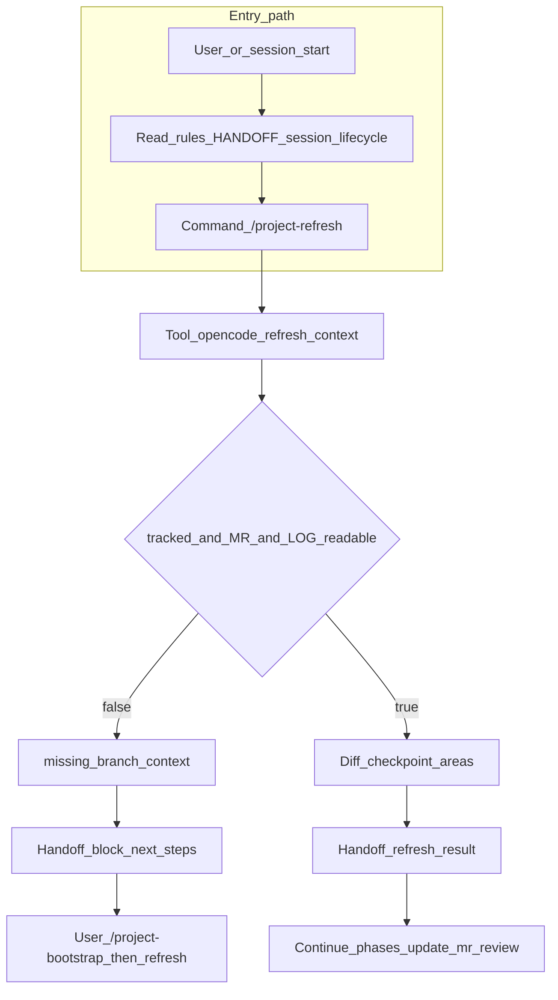
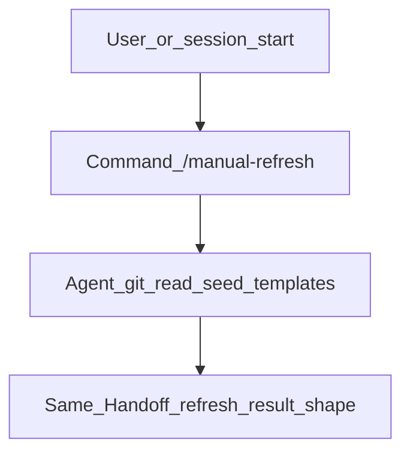
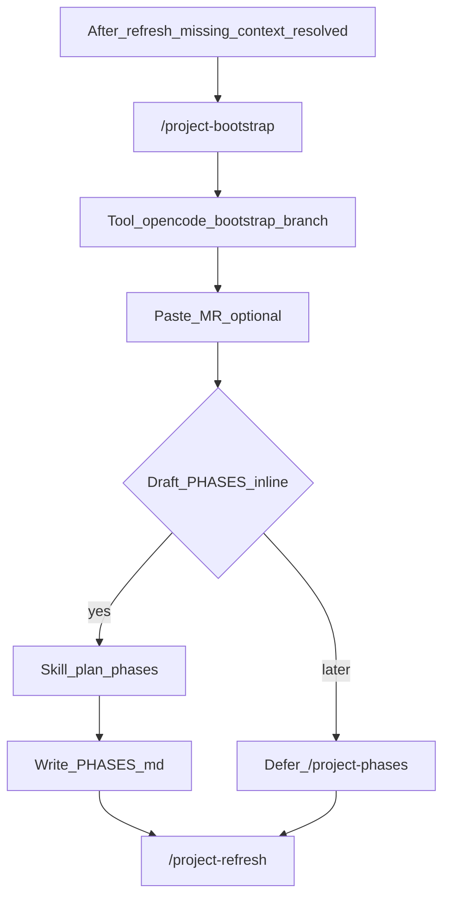
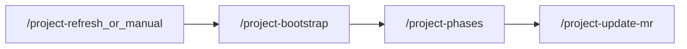
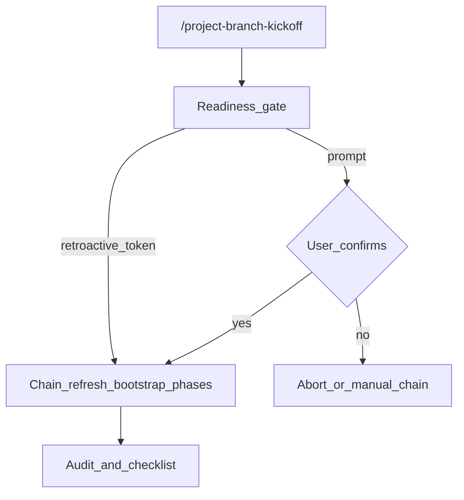
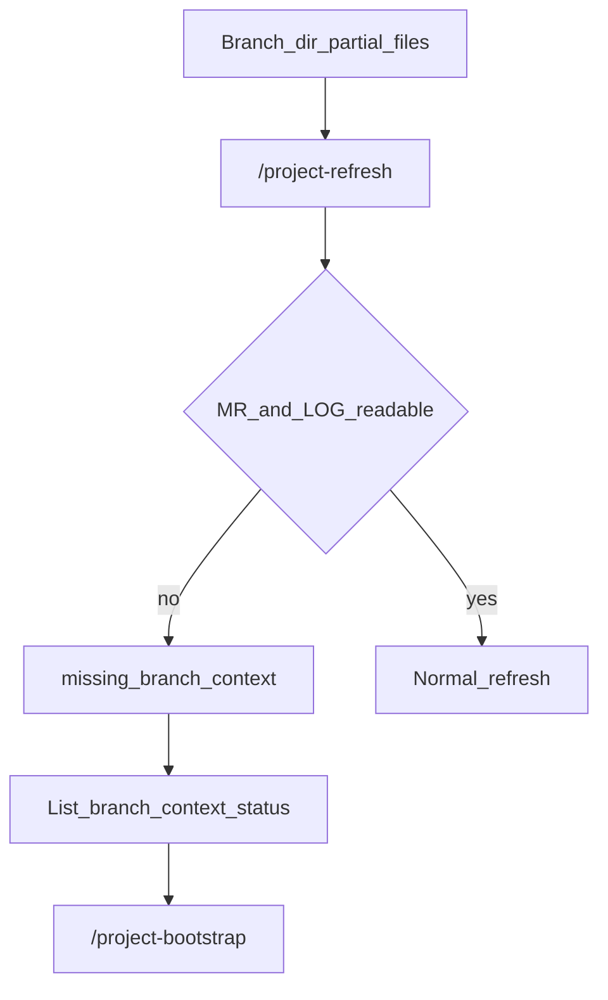

# Branch context workflow maps

Mermaid diagrams for **tool** vs **manual** paths. When Bedrock or policy disables Bun tools, substitute **`/manual-refresh`** for **`/project-refresh`** and the same **`## Handoff refresh result`** shape ([`commands/manual-refresh.md`](../commands/manual-refresh.md)).

**Legend:** **Rules** = project `AGENTS.md` + HANDOFF docs. **Branch files** = `MERGE_REQUEST.md`, `LOG.md`, `PHASES.md`, optional `REVIEW.md`. **Repo knowledge** = in-repo **`AGENTS.md`** per area (recommended; auto-discovered by OpenCode via directory traversal, pointed to by `areaAgentsPath`) + leaf **`KNOWLEDGE.md`**; optional project-wide **`KNOWLEDGE.md`**; optional **`areaKnowledgePath`** for teams that split area facts from area rules.

## A — Session entry (tool lane)

## A — Manual lane (Bedrock / no tools)

## B — Bootstrap with optional inline phases

## C — Retro minimal chain

## D — Branch kickoff (high ceremony)

## E — Partial branch context

When diagrams and commands diverge, update this file in the **same PR** as the command change.
